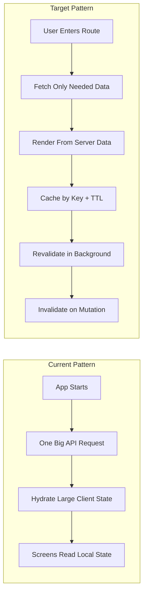

## 4) React Architecture: From Big Stateful Load to Stateless + Caching (20 min)

### Your task (candidate)
Today, the app hydrates almost everything at startup via one big API call and keeps it all in client state.

Walk through how you would:
1. Redesign toward a more stateless model.
2. Add practical caching without overcomplicating the system.

### What “today” looks like
- One large startup API call
- One huge client-side state object
- Most screens read from that in-memory state

### Visual: Current → Target

### What to cover in your answer
- Which data should no longer be globally hydrated at startup?
- How would you define page/feature fetch boundaries?
- What cache key strategy and TTL would you use?
- How would you handle invalidation and stale-while-revalidate behavior?
- What UX states matter (loading, optimistic updates, partial failure)?
- What metrics prove this improved the architecture?

### Expected output format (quick)
- 2–3 minute high-level architecture walkthrough
- 1 concrete request/caching example
- 1 short migration plan (phased rollout)
